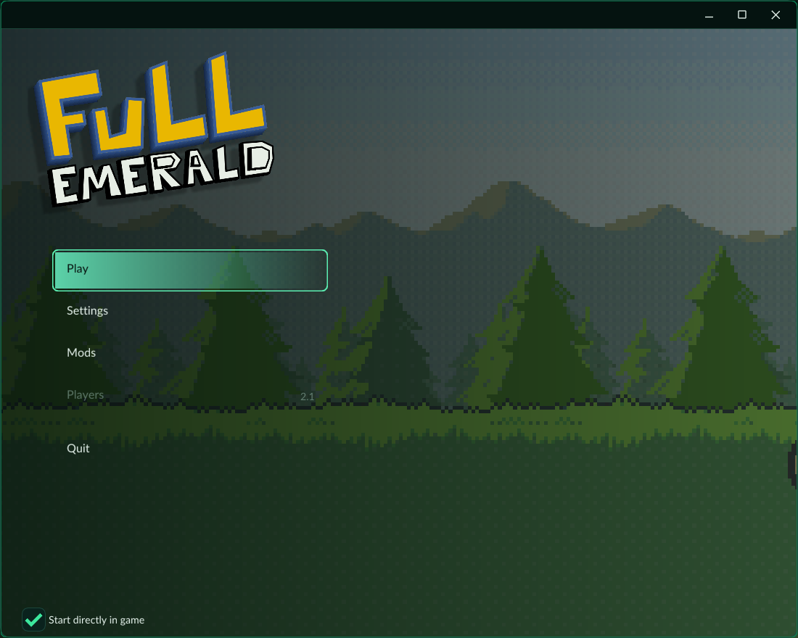
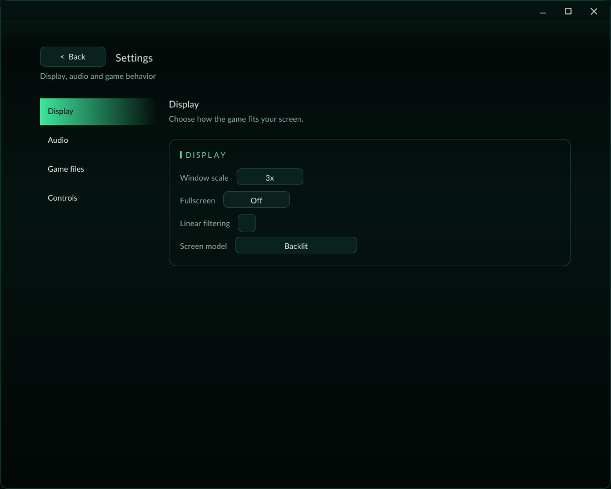
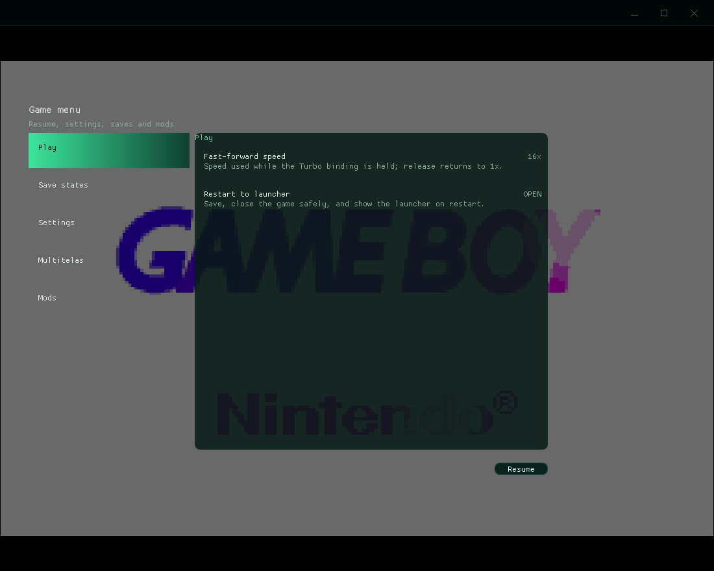
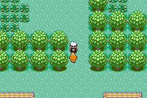

  

  Uma recompilação estática de Pokémon Emerald para PC, com interface própria,
  suporte completo a controles, mods e ferramentas modernas de preservação.

  
  
  
  

> [!IMPORTANT]
> O Full Emerald **não inclui ROM, BIOS, save ou código gerado da ROM**. É
> necessário usar dumps obtidos legalmente pelo próprio usuário. Atualmente o
> motor público funciona somente com a revisão específica em português indicada
> em [Compatibilidade](#compatibilidade). A portabilidade para as demais regiões
> e idiomas oficiais está em desenvolvimento.

## O projeto

O **Full Emerald** transforma a base experimental
[`EmeraldRecomp`](https://github.com/mstan/EmeraldRecomp) em uma experiência de
desktop integrada. O código ARM7TDMI do cartucho é traduzido estaticamente para
C/C++ pelo [`gbarecomp`](https://github.com/mstan/gbarecomp); o runtime modela o
hardware do GBA e a interface é construída sobre
[`recomp-ui`](https://github.com/mstan/recomp-ui).

O objetivo é parecer um jogo de PC, não uma janela de emulador: primeira
configuração guiada, launcher clean, menu dentro do jogo, navegação por controle,
atalhos, estados rápidos, mods e uma experiência portátil.

### O que veio pronto e o que foi criado aqui

- **Base upstream:** tradução estática ARM/Thumb, runtime de GBA, PPU/APU,
  Flash/RTC, depuração, launcher compartilhado e configuração original do
  Emerald.
- **Full Emerald:** identidade e fluxo 2.0, integração launcher/jogo,
  controle analógico e hot-plug, bindings de teclado e gamepad, turbo com
  multiplicador, quick save/load, retorno seguro ao launcher, multitelas
  experimental, infraestrutura de mods e o mod Pokémon Follower.
- **Referências, sem copiar código:** Gen1Recomp para ideias de experiência,
  Dusklight para direção de interface e PokePCFollowers para o conceito de
  seguidor. Consulte [CREDITS.md](CREDITS.md).

Estimativa pelo código manual da stack: aproximadamente **97–98% da fundação**
veio dos projetos upstream e **2–3%** corresponde às integrações, recursos e
polimento específicos do Full Emerald. O grande volume de C gerado da ROM não é
contado como código escrito manualmente e não é versionado.

## Recursos

| Recurso | Estado |
|---|---|
| Boot, mundo, batalhas, áudio, Flash1M e RTC | Validado nos caminhos testados |
| Execução strict-static | 0 misses/0 instruções interpretadas nos testes aceitos |
| Launcher e menu dentro do jogo | Disponível |
| Teclado, D-pad, analógico, hot-plug e GUID de controle | Disponível |
| Rebind de botões GBA e atalhos no teclado/controle | Disponível |
| Turbo segurado, multiplicador 1–16× ou ilimitado | Disponível |
| Quick Save/Quick Load, 9 slots | Disponível |
| Pokémon Follower | Mod opcional, desativado por padrão |
| Multitelas de 1 a 12 instâncias | **Experimental** |
| Link Cable e multiplayer local por jogadores | Planejado |
| Outras regiões/idiomas da ROM | Em desenvolvimento; ainda não habilitado |
| Renderização voxel/3D | Pesquisa futura |

## Interface atual

| Configurações | Menu dentro do jogo |
|---|---|
|  |  |

| Mod Pokémon Follower |
|---|
|  |

As imagens acima representam somente a interface atual da versão 2.0. Capturas
antigas do protótipo não são usadas nesta página.

## Compatibilidade

| Alvo | SHA-1 da ROM | CRC32 | Estado |
|---|---|---|---|
| Tradução PT-BR Zambrakas (2013, sem Day/Night) | `18a2b0acdba046c71b8677bb58c9ee7d36f7a91f` | `BD826A51` | **Suportado atualmente** |
| Emerald USA | `f3ae088181bf583e55daf962a92bb46f4f1d07b7` | `1F1C08FB` | Perfil reservado; motor em desenvolvimento |
| França, Alemanha, Espanha e Japão | — | — | Dumps adquiridos para pesquisa; adaptação e validação pendentes |

O hash é uma barreira de segurança: texto e dados podem mudar entre revisões,
mas também podem mudar instruções traduzidas. Aceitar outro dump sem gerar e
validar seu motor poderia executar código incorreto. O plano é manter uma
interface única que selecione internamente o motor correspondente a cada ROM
oficial validada.

## Como usar

1. Compile o projeto seguindo [BUILDING.md](BUILDING.md).
2. Abra `Full Emerald.exe`.
3. Na primeira execução, selecione a ROM PT-BR reconhecida e um dump de BIOS GBA
   de 16 KiB obtido do seu próprio hardware.
4. Configure teclado ou controle e selecione **Play**.
5. Use o botão Guide/Home para abrir o menu durante o jogo.

O programa guarda apenas os caminhos e as preferências. ROM e BIOS não são
copiadas para o repositório nem para um pacote público.

### Controles padrão

| Ação | Teclado | Controle SDL |
|---|---|---|
| Direções | Setas | D-pad ou analógico esquerdo |
| A / B | `X` / `Z` | Sul / Leste |
| L / R | `C` / `V` | Ombros |
| Start / Select | Enter / Shift direito | Start / Back |
| Turbo | Tab | Gatilho direito |
| Quick Save / Quick Load | Shift+F1 / F1 | Configurável |
| Menu do jogo | — | Guide/Home |
| Tela cheia | Alt+Enter | Configurável |

Todos os bindings podem ser alterados. Turbo volta imediatamente a 1× ao
soltar o botão.

## Mods

Pacotes `.gbamod` são arquivos ZIP de dados com manifesto TOML. Eles não podem
injetar DLLs nem código arbitrário. Comportamentos nativos confiáveis são
compilados junto do jogo e ativados por IDs declarados no pacote.

O exemplo incluído é **Pokémon Follower**: o primeiro Pokémon saudável e que não
seja Egg segue o jogador. O código do mod está no repositório, mas o pacote de
sprites não é redistribuído; gere-o localmente a partir de recursos que você
tenha permissão para usar. Veja [MODDING.md](MODDING.md).

## Multitelas

O modo experimental executa até 12 workers isolados em uma janela composta.
Cada worker mantém seu próprio save, save states e seed de RNG; o supervisor
distribui o mesmo input e recolhe os framebuffers por memória compartilhada.

Ele foi criado para testes repetidos e shiny hunting, mas ainda não é tratado
como multiplayer ou Link Cable. Não confunda sincronização de ritmo com
igualdade de RNG: as instâncias precisam continuar independentes.

Detalhes e limitações estão em [ARCHITECTURE.md](ARCHITECTURE.md) e
[ROADMAP.md](ROADMAP.md).

## Desenvolvimento

- [Compilar e testar](BUILDING.md)
- [Arquitetura](ARCHITECTURE.md)
- [Criar mods](MODDING.md)
- [Créditos e proveniência](CREDITS.md)
- [Licenciamento e avisos legais](LEGAL.md)
- [Contribuir](CONTRIBUTING.md)
- [Roadmap](ROADMAP.md)
- [Política de segurança](SECURITY.md)

## English summary

Full Emerald is a Windows-oriented static recompilation project built from
EmeraldRecomp, gbarecomp and recomp-ui. It adds an integrated game-like UI,
controller-first navigation, configurable keyboard/gamepad bindings, quick
states, fast-forward, a data/package mod model, an optional Pokémon follower
and an experimental multi-instance compositor. The current public engine only
supports one verified Portuguese translation revision; support for other
official regions/languages is in progress. No ROM, BIOS, save, generated guest
code or follower sprite pack is distributed.

## Aviso legal

Full Emerald é um projeto comunitário, não comercial e não afiliado à Nintendo,
Game Freak ou The Pokémon Company. Pokémon e nomes relacionados pertencem aos
respectivos titulares. A presença pública do código não substitui as licenças
dos componentes; leia [LEGAL.md](LEGAL.md) antes de redistribuir ou criar
derivados.
